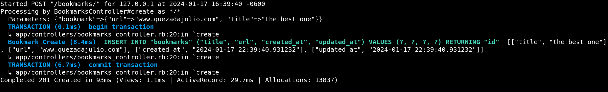
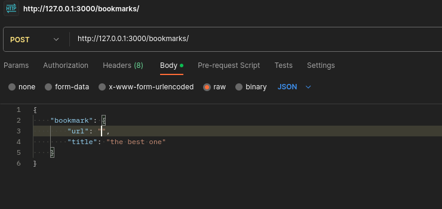
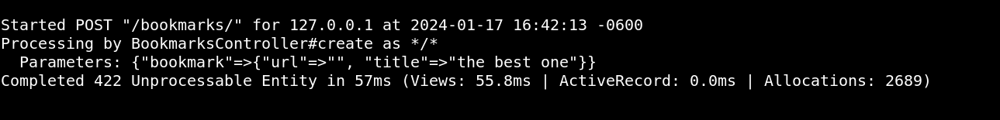

# api-testing-spec

<a name="readme-top"></a>
<div align="center">
    
  <br/>
  <h3><b>API Testing Spec</b></h3>
</div>
# 📗 Table of Contents

- [api-testing-spec](#api-testing-spec)
- [📗 Table of Contents](#-table-of-contents)
- [📖 API Testing Spec ](#-api-testing-spec-)
  - [🛠 Built With ](#-built-with-)
    - [Tech Stack ](#tech-stack-)
    - [Key Features ](#key-features-)
  - [💻 Getting Started ](#-getting-started-)
    - [Prerequisites](#prerequisites)
    - [Setup](#setup)
    - [Install](#install)
    - [Database](#database)
    - [Usage](#usage)
    - [Run tests](#run-tests)
    - [Run linter](#run-linter)
    - [Deployment](#deployment)
    - [Test with postman](#test-with-postman)
  - [👥 Authors ](#-authors-)
  - [🔭 Future Features ](#-future-features-)
  - [🤝 Contributing ](#-contributing-)
  - [⭐️ Show your support ](#️-show-your-support-)
  - [🙏 Acknowledgments ](#-acknowledgments-)
  - [❓ FAQ ](#-faq-)
  - [📝 License ](#-license-)

# 📖 API Testing Spec <a name="about-project"></a>

The API Testing Spec is a project designed to practice API testing. This project is based on a written tutorial, which I will reference below. I chose a written tutorial because, after creating this small project, I plan to implement testing in my own project, utilizing the knowledge I gained from here, alongside reading the documentation and some books.

## 🛠 Built With <a name="built-with"></a>

### Tech Stack <a name="tech-stack"></a>

  <ul>
    <li><a href="https://rubyonrails.org/">Ruby on Rails 7.1.2</a></li>
    <li><a href="https://www.sqlite.org/index.html">SQLite3</a></li>
  </ul>

### Key Features <a name="key-features"></a>

- **Use RSpect to test API**


<p align="right">(<a href="#readme-top">back to top</a>)</p>


## 💻 Getting Started <a name="getting-started"></a>

To get a local copy up and running, follow these steps.

### Prerequisites

In order to run this project you need:

[Install Ruby](https://www.ruby-lang.org/en/documentation/installation/)

### Setup

```sh
cd my-folder
git clone https://github.com/Alejandroq12/api-testing-rspec.git
```

### Install

Install all necessary dependencies listed in the `Gemfile`.

```sh
bundle install
```


### Database

Create databse:

```sh
rake db:create
```

Run migrations:

```sh
rails db:migrate
```

Add the seeds(omit it for this project):

```sh
rails db:seed
```

### Usage

To run the project, navigate to the project directory and execute the following command:

```sh
rails server
```

### Run tests

To run tests, run the following command:

```sh
rspec
```

### Run linter

To run linter, run the following command:

```sh
rubocop
```

### Deployment

You can deploy this project using:

Not available at the moment.

<p align="right">(<a href="#readme-top">back to top</a>)</p>

### Test with postman

Send a POST request with valid parameters:

Answer of a POST request with valid parameters:


Send a POST request with invalid parameters:

Error as a result of a POST request with invalid parameters:


<p align="right">(<a href="#readme-top">back to top</a>)</p>

## 👥 Authors <a name="authors"></a>

👤 **Julio Quezada**

- GitHub: [Alejandroq12](https://github.com/Alejandroq12)
- Twitter: [@JulioAle54](https://twitter.com/JulioAle54)
- LinkedIn: [Julio Quezada](https://www.linkedin.com/in/quezadajulio/)

<p align="right">(<a href="#readme-top">back to top</a>)</p>

## 🔭 Future Features <a name="future-features"></a>

- [] **Test CRUD actions.**
- [] **Create a health check controller.**
- [] **Create a CRUD acaffold.**
- [] **Test autehtication.**


<p align="right">(<a href="#readme-top">back to top</a>)</p>

## 🤝 Contributing <a name="contributing"></a>

Contributions, issues, and feature requests are welcome!

<p align="right">(<a href="#readme-top">back to top</a>)</p>

<!-- SUPPORT -->

## ⭐️ Show your support <a name="support"></a>

If you like this project please give a star.
Thanks in advance.

<p align="right">(<a href="#readme-top">back to top</a>)</p>

<!-- ACKNOWLEDGEMENTS -->

## 🙏 Acknowledgments <a name="acknowledgements"></a>

I would like to thank Axel Kee for creating the written tutorial for this project [Axel Kee](https://rubyyagi.com/rspec-request-spec/)

<p align="right">(<a href="#readme-top">back to top</a>)</p>

<!-- FAQ (optional) -->

## ❓ FAQ <a name="faq"></a>

**What did you learn?**

- I learned a lot about testing CRUD actions, testing authentication, testing request specs, and setting up a Rails app.

<p align="right">(<a href="#readme-top">back to top</a>)</p>

## 📝 License <a name="license"></a>

This project is [MIT](./LICENSE) licensed.

<p align="right">(<a href="#readme-top">back to top</a>)</p>
